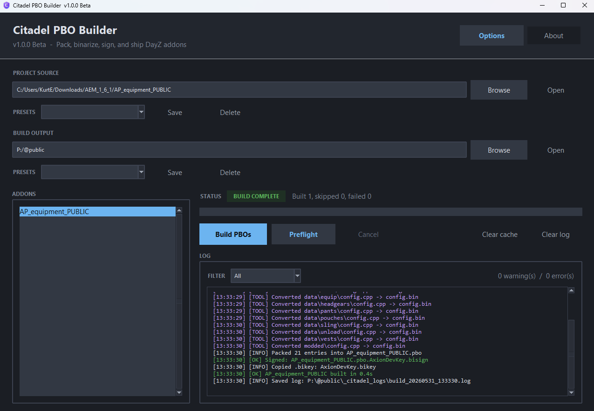
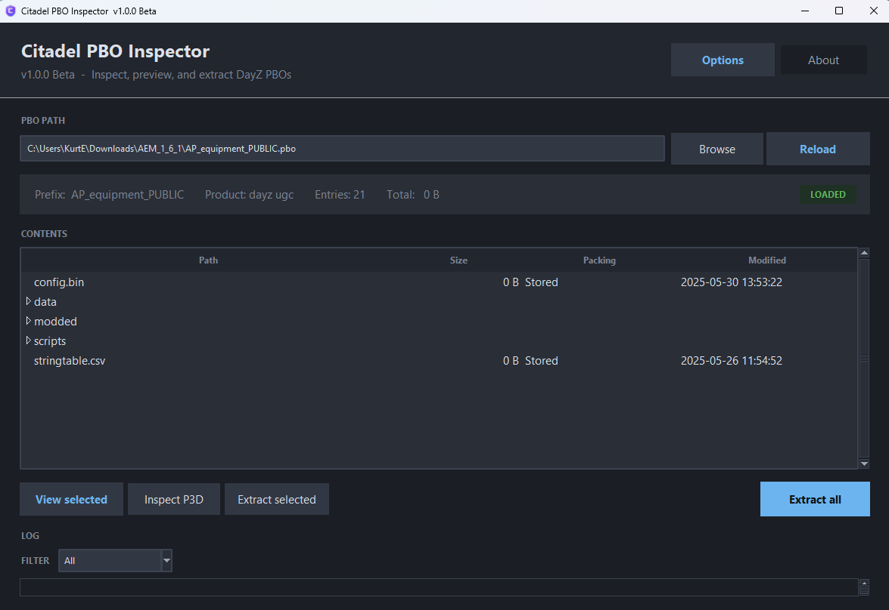

<div align="center">


# Citadel PBO Tools

**A modern DayZ PBO build and inspection suite for the Citadel team.**

[](https://github.com/Sk3tch-Dev-Ux/Citadel_PBO_Tools/actions/workflows/test.yml)
[](https://github.com/Sk3tch-Dev-Ux/Citadel_PBO_Tools/releases)
[](https://www.python.org/)
[](#requirements)
[](LICENSE.txt)

[Download Latest](https://github.com/Sk3tch-Dev-Ux/Citadel_PBO_Tools/releases/latest)
 · [Changelog](CHANGELOG.md)
 · [Contributing](CONTRIBUTING.md)
 · [Report a bug](https://github.com/Sk3tch-Dev-Ux/Citadel_PBO_Tools/issues/new?template=bug_report.md)

</div>

---

Citadel PBO Tools is a two-app Windows suite for DayZ addon developers and
mappers. It packs, binarizes, signs, and inspects DayZ PBO archives, with a
configurable preflight engine that catches the common addon problems before
a broken `.pbo` ever leaves the build folder.

- **Citadel PBO Builder** — the addon build pipeline.
- **Citadel PBO Inspector** — read, preview, and extract existing PBOs.

The visual language is shared with the [DayzServerController] project so
the Citadel desktop tools and the Citadel server console feel like one
ecosystem.

[DayzServerController]: https://github.com/Sk3tch-Dev-Ux/DayzServerController

---

## Highlights

- **Builder pipeline** — stage, exclude, optional `.paa` refresh, parallel
  Binarize of `.p3d` and terrain `.wrp`, root + nested `config.cpp` -> `.bin`,
  pack, sign, and safely publish.
- **Round-trip-safe extraction** — Inspector writes `$PBOPREFIX$` next to
  extracted files so a rebuild from an extracted folder produces the
  correct internal addon prefix instead of falling back to the folder name.
- **Content-fingerprint cache** — file edits that keep size and mtime
  identical still invalidate the cache, so rebuilds are never silently
  stale.
- **DayZ Tools auto-detection** across every Steam library
  (registry + `libraryfolders.vdf`), not just the C-drive default.
- **Preflight engine** with thirteen toggleable checks: config syntax,
  `CfgPatches`, `requiredAddons[]`, reference scanning, terrain WRP +
  `worldName`, navmesh, terrain size, source/export warnings, risky paths,
  case-only conflicts, script `modded class` declarations, and more.
- **Independent named presets** for Project Source and Build Output paths.
- **Threaded discovery + bounded walks** so pointing at a huge project
  (or a misclicked `C:\`) does not freeze the GUI.
- **Single-EXE distribution** — `Citadel_PBO_Builder.exe` and
  `Citadel_PBO_Inspector.exe` are standalone, no Python install required
  to run them.

---

## Screenshots

> Drop `Citadel_PBO_Builder.png` and `Citadel_PBO_Inspector.png` into
> `docs/screenshots/` and they will render here.

<table>
<tr>
<td align="center"><strong>Builder</strong><br></td>
<td align="center"><strong>Inspector</strong><br></td>
</tr>
</table>

---

## Installation

### Option A — download a release (recommended)

Grab the latest zip from the [Releases page][releases]. Unzip and either:

- **Double-click the EXEs.** No Python install required.
- **Pin them to your taskbar** for quick access.

[releases]: https://github.com/Sk3tch-Dev-Ux/Citadel_PBO_Tools/releases/latest

Verify the downloads with the included `SHA256SUMS.txt`:

```powershell
Get-FileHash Citadel_PBO_Builder.exe -Algorithm SHA256
Get-FileHash Citadel_PBO_Inspector.exe -Algorithm SHA256
```

### Option B — run from source

```powershell
git clone https://github.com/Sk3tch-Dev-Ux/Citadel_PBO_Tools.git
cd Citadel_PBO_Tools
python -m pip install -r requirements.txt
python citadel_pbo_builder.py     # or citadel_pbo_inspector.py
```

Python 3.11+ required.

### Option C — build the EXEs yourself

```powershell
python -m pip install -r requirements-dev.txt
.\scripts\build_citadel_pbo_builder.ps1
.\scripts\build_citadel_pbo_inspector.ps1
```

The compiled `Citadel_PBO_Builder.exe` and `Citadel_PBO_Inspector.exe`
land in `dist/`.

---

## Getting started

1. Open **Citadel PBO Builder**.
2. Open **Options** and either click **Auto-detect from Steam** or browse
   to `Binarize.exe`, `CfgConvert.exe`, `ImageToPAA.exe`, and
   `DSSignFile.exe`. Point at your `.biprivatekey` if you want signed
   PBOs.
3. Set **Project Source** to your addon source folder.
4. Set **Build Output** to where you want the finished `.pbo` to land.
5. Save them as presets so you can switch projects quickly.
6. Pick an addon in the list and hit **Build PBOs**.

For an existing PBO, open **Citadel PBO Inspector**, drag the `.pbo` into
the window (or browse to it), then click **Extract all**. The files land
next to the PBO in `<pbo-name>_extracted/` and the original prefix is
preserved as `$PBOPREFIX$` so you can rebuild from the extracted folder
without breaking paths.

---

## Output structure

The Builder creates this layout under your Build Output folder:

```
<output>/
  Addons/                       # .pbo + .bisign published here
  Keys/                         # .bikey copied here
  _citadel_build_tmp/           # per-addon staging temp (cleaned on success)
  _citadel_logs/                # build_YYYYMMDD_HHMMSS.log
  _citadel_preflight_reports/   # preflight_<addon>_<time>.txt and .json
```

User settings live in `%APPDATA%\Citadel\PBO_Tools\` and survive EXE
upgrades and reinstalls.

---

## Preflight checks

Each check produces zero or more findings tagged INFO / WARNING / ERROR.
Findings are written to the log, summarized in the status bar, and
exported to `_citadel_preflight_reports/` as both `.txt` and `.json` when
launched explicitly.

| Toggle                              | Catches                                  |
| ----------------------------------- | ---------------------------------------- |
| `requiredAddons` hints              | Empty / missing `requiredAddons[]`       |
| Texture freshness                   | `.paa` older than its `.png` / `.tga`    |
| Risky path names                    | Reserved characters in paths             |
| Case-only path conflicts            | Same path differing only in case         |
| P3D internal scan                   | Pre-binarized ODOL `.p3d` in source      |
| Terrain / WRP checks                | `worldName` validation, `CfgWorlds`      |
| Terrain navmesh checks              | Missing / empty navmesh folders          |
| WRP internal scan                   | Internal `.wrp` reference scan (slower)  |
| Terrain source/export warnings      | `.pew`, `.raw`, `.tv4p`, etc.            |
| Terrain layer checks                | Layer / RVMAT folder shape               |
| 2D map config checks                | 2D map image / config wiring             |
| Terrain size checks                 | Outsized addons or folders               |
| Script checks                       | `modded class` with illegal base class   |

---

## Requirements

- Windows 10 or later (Windows 11 recommended)
- DayZ Tools installed via Steam (or any path you point Options at)
- `Binarize.exe`, `CfgConvert.exe`, `ImageToPAA.exe`, `DSSignFile.exe`
  from DayZ Tools
- A `.biprivatekey` if signing is enabled

Python is not required when running the published EXEs.

---

## Development

```powershell
python -m pip install -r requirements-dev.txt
python -m pytest          # 19 tests, ~0.1s
```

See [CONTRIBUTING.md](CONTRIBUTING.md) for the project layout, coding
conventions, and release flow.

---

## Key safety

Never share your `.biprivatekey`. Distribute only the matching `.bikey`.
Your private key is the signing identity for everything Citadel ships —
guard it like an SSH key.

---

## License

Citadel PBO Tools is proprietary software owned by Citadel. See
[`LICENSE.txt`](LICENSE.txt) for the full terms. The repository is public
for transparency and to make distribution easier, but the license still
restricts resale, sublicensing, and inclusion in unrelated commercial
products without prior written permission from Citadel.

---

## Disclaimer

Provided "as-is" without warranty. Citadel is not liable for damaged
files, lost data, invalid PBOs, broken signatures, leaked keys, or any
other damage caused by the use or misuse of this software.
